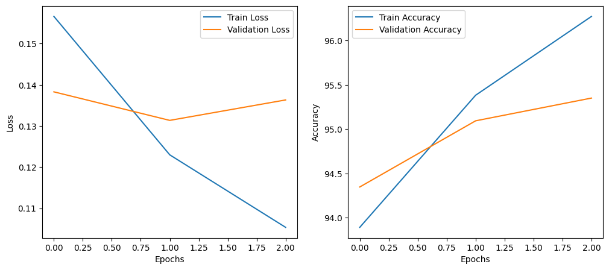
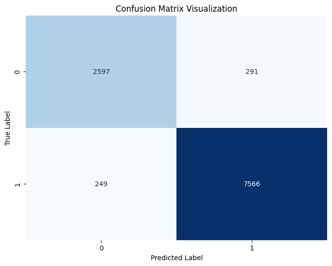

# 使用 BertForSequenceClassification 做分類器

### 結果



**Best Val Loss: 0.1314, Best Val Accuracy: 95.09%**

**Test Accuracy: 95%**

### 資料格式

```json
    {
        "title": "[公告] 旅遊醫學資訊網站",
        "author": "Grosjean",
        "time": {
            "year": "2004",
            "month": 12,
            "date": "2",
            "hour": "12",
            "minute": "35"
        },
        "content": "http://tinyurl.com/5v2yf 旅遊醫學資訊網站 \"國際旅遊疾病預防的建議\" \"旅行前的健康諮詢\" \"旅行出發前，應做哪些保健行為？\" \"哪些情況應該要暫停旅行？\" 希望各位版友多多利用，快樂的出門旅遊，平安的回家 玩得安全才是最重要的。 感謝aren版友提供 版工Grosjean敬上 -- ▌ ◢ ▌◣ █ █■︵■ ███ █ █ █ ███ ███ █ ◥　ｏ◤▌～●～●～●～●█ █ █ █ █◣ █◤ █ ██ ▇▆▅▎ ～●～●～●～● ◢█ █ █◤█◥ ███ ◢█ ◢█◤ ▇▅▅ ◢█◤ ◤ ◤ █ ◢█◤ ◥█◣ ◢█◤ -- ◆ From: 218.160.31.71"
    },
```

### 資料分類

根據標題標籤分類旅遊、非旅遊相關的文章，排除掉數量過少的標題

travel_related_titles = ['遊記', '心得', '問題', '食記', '徵伴', '分享', '住宿', '新聞', '黑特', '旅遊', '玩樂', '請益', '美食', '抱怨', '推薦']

non_travel_related_titles = ['交易', '廣告', '情報', '問卷', '資訊', '徵求', '公告', '講座', '揪團', '贈送', '閒聊', '轉讓', '廣宣', '活動', '已售出', '售出', '票券', '請問', '轉錄', '買賣', '徵']

travel_related_titles : 39072
non_travel_related_titles : 14439

### 資料處裡

**刪除垃圾文字**

1. 刪除以 "※ 引述《...》之銘言"
2. 刪除 "※ [本文轉錄自....]"，例如"※ [本文轉錄自 India 看板 #1B-Dirji ]"
3. 移除作者、看板、標題、時間信息
4. 移除網址
5. 移除 "...圖文版 :"， 前面至多刪除五個字元
6. 移除以 "※ 發信站:" 開頭的後續所有句子
7. 刪除非字母、數字、中文標點符號和引號的字符

**encoding**

使用 tokenizer : `BertTokenizer.from_pretrained('bert-base-chinese')`

設定每個文本編碼的最大長度為 512

```python
train_encodings = data_handler.gen_encoded_data(train_texts, max_length=512)
```

**訓練資料**

訓練、驗證資料 : 旅遊相關 \* 0.8 + 非旅遊相關 \* 0.8 = 42808
測試資料 : 旅遊相關 \* 0.2 + 非旅遊相關 \* 0.2 = 10703

```python
data_handler = DataHandler(tokenizer_name='bert-base-chinese')

encodings = load_encoded_data('encoded_data/train/encodings_512')
labels = load_encoded_data('encoded_data/train/labels')

length = len(labels)
train_indices, val_indices = train_test_split(np.arange(length), test_size=0.2, random_state=42)

train_dataset = Subset(create_dataset(encodings, labels), train_indices)
val_dataset = Subset(create_dataset(encodings, labels), val_indices)
```

### 訓練

模型 : `BertForSequenceClassification.from_pretrained('bert-base-chinese', num_labels=2)`
batch\*size=32
epochs : 3
optimizer : Adam
learning rate : 0.00005

```python
device = torch.device("cuda" if torch.cuda.is_available() else "cpu")

classifier = TravelDocClassifier(device=device)
stats = classifier.train(train_dataset, val_dataset, epochs=3, batch_size=32, learning_rate=5e-5, patience=2)
```

## 測試

```python
device = torch.device("cuda" if torch.cuda.is_available() else "cpu")

classifier = TravelDocClassifier(device=device, params_path='parameters/20240604_9509_model_parameters.pth')
test_accuracy, confusion = classifier.test(test_dataset)
```

### 測試結果



**精確率 (Precision): 0.9099**

**召回率 (Recall): 0.9062**

**特異性 (Specificity): 0.9669**

**F1 Score: 0.9080**
